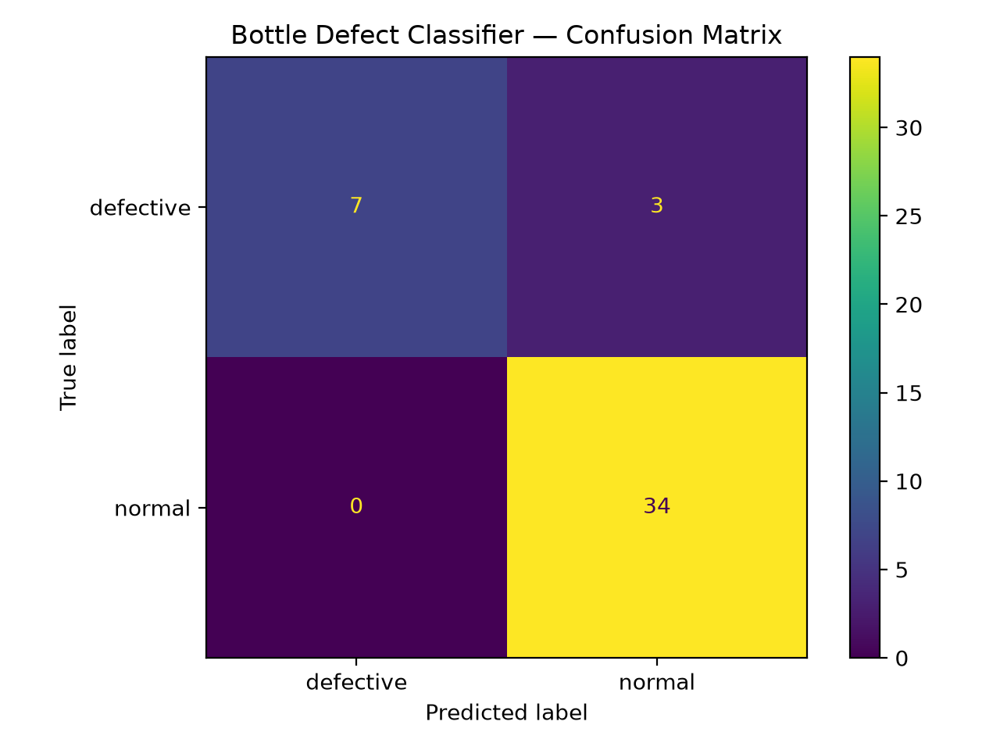
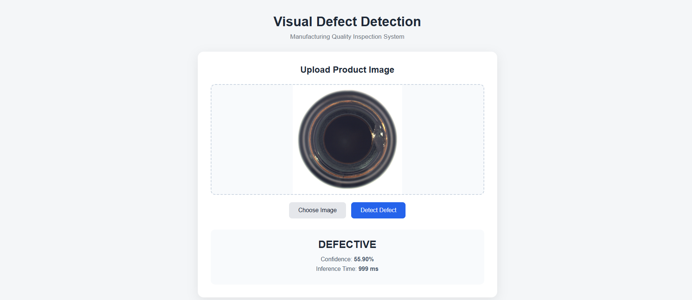

# Visual Defect Detection System

A production-oriented computer vision system for detecting manufacturing defects in product images.

The system classifies product images into two classes:

- **Normal**
- **Defective**

The project includes dataset preparation, preprocessing, transfer-learning based model training, evaluation, error analysis, and a FastAPI inference application with a simple web interface.

---

## 1. Project Overview

The goal of this project is to build a visual inspection system that can automatically identify defective products from images.

The overall workflow is:

```text
Product Image
      |
      v
Image Validation
      |
      v
Preprocessing
(224 x 224 + Normalization)
      |
      v
EfficientNet-B0
(Transfer Learning)
      |
      v
Classification
      |
      +----------------+
      |                |
      v                v
   Normal          Defective
      |                |
      +-------+--------+
              |
              v
   Prediction + Confidence
```

The trained model is exposed through a FastAPI application that accepts an image and returns the predicted class and confidence score.

A simple browser-based interface is also included for uploading an image and viewing the prediction.

---

## 2. Project Structure

```text
Visual_Defect_Detection_System/
|
├── api/
│   ├── __init__.py
│   ├── main.py
│   └── static/
│       ├── index.html
│       ├── style.css
│       └── script.js
|
├── data/
│   ├── raw/
│   │   └── mvtec_ad/
│   │       └── bottle/
│   ├── train/
│   │   ├── defective/
│   │   └── normal/
│   ├── val/
│   │   ├── defective/
│   │   └── normal/
│   └── test/
│       ├── defective/
│       └── normal/
|
├── notebooks/
│   ├── 1_dataset_preparation.ipynb
│   ├── 2_model_training.ipynb
│   ├── 3_evaluation.ipynb
│   └── 4_error_analysis.ipynb
|
├── models/
│   ├── best_model.pth
│   └── class_names.json
|
├── results/
│   ├── confusion_matrix.png
│   ├── evaluation_metrics.json
│   ├── test_predictions.csv
│   └── errors/
|
├── src/
│   ├── __init__.py
│   ├── dataset.py
│   ├── model.py
│   ├── train.py
│   ├── evaluate.py
│   └── error_analysis.py
|
├── tests/
│   └── test_api.py
|
├── requirements.txt
├── Dockerfile
├── .dockerignore
├── .gitignore
└── README.md
```

---

## 3. Setup Instructions

### Requirements

- Python 3.10+
- PyTorch
- Torchvision
- FastAPI
- Uvicorn
- Scikit-learn
- Pandas
- NumPy
- Pillow
- Matplotlib

Docker can also be used for containerized deployment.

### Create a Virtual Environment

On Windows PowerShell:

```powershell
python -m venv venv
```

Activate the environment:

```powershell
.\venv\Scripts\Activate.ps1
```

### Install Dependencies

```powershell
pip install -r requirements.txt
```

---

## 4. Dataset Strategy

The project uses the **MVTec AD Bottle** category as the development dataset.

The original MVTec AD dataset contains defect-free training images and both defect-free and defective test images.

For this project, a custom binary-classification protocol was created to match the requirements of the assessment.

### Classes

```text
Normal
Defective
```

The original Bottle category contains:

```text
good
broken_large
broken_small
contamination
```

The `good` images are mapped to:

```text
normal
```

The defect categories are mapped to:

```text
defective
```

### Dataset Organization

The raw dataset is kept under:

```text
data/raw/mvtec_ad/bottle/
```

The processed dataset is organized as:

```text
data/
|
├── train/
│   ├── normal/
│   └── defective/
|
├── val/
│   ├── normal/
│   └── defective/
|
└── test/
    ├── normal/
    └── defective/
```

### Train / Validation / Test Split

A stratified split is used:

```text
70% -> Training
15% -> Validation
15% -> Testing
```

Stratification is used to maintain the class distribution across the subsets.

### Important Dataset Note

MVTec AD was originally designed primarily for anomaly detection rather than conventional supervised binary classification.

Therefore, this project uses a **custom binary-classification protocol** for the assessment.

The reported results should not be interpreted as official MVTec AD benchmark results.

The raw dataset is not included in the GitHub repository.

---

## 5. Data Preprocessing and Augmentation

Images are resized to:

```text
224 x 224
```

Training augmentation includes:

- Random horizontal flip
- Small random rotation
- Brightness adjustment
- Contrast adjustment

Images are normalized using ImageNet statistics:

```text
Mean = [0.485, 0.456, 0.406]
Std  = [0.229, 0.224, 0.225]
```

Validation and test images use deterministic preprocessing without random augmentation.

---

## 6. Handling Class Imbalance

Class distribution is analyzed before training.

To reduce the effect of class imbalance, inverse-frequency class weights are used in the Cross Entropy loss.

Conceptually:

```text
Class Weight proportional to 1 / Class Frequency
```

This gives relatively greater importance to underrepresented classes during training.

---

## 7. Model Approach

### EfficientNet-B0

The main classification model is **EfficientNet-B0** with ImageNet pretrained weights.

The original classifier is replaced with a two-class classification head:

```text
EfficientNet-B0
       |
       v
Feature Extraction
       |
       v
Linear Classification Layer
       |
       v
2 Classes
       |
       +---- Defective
       |
       +---- Normal
```

### Why EfficientNet-B0?

EfficientNet-B0 was selected because it provides a practical balance between:

- Classification performance
- Model size
- Computational cost
- Inference latency
- Suitability for transfer learning

For a relatively small image dataset, transfer learning allows the model to start from useful visual features learned from ImageNet instead of training the complete network from scratch.

---

## 8. Training

The training pipeline uses:

- PyTorch
- EfficientNet-B0
- ImageNet pretrained weights
- Weighted Cross Entropy Loss
- AdamW optimizer
- Data augmentation
- Validation monitoring

The best model checkpoint is saved to:

```text
models/best_model.pth
```

The class mapping is stored in:

```text
models/class_names.json
```

---

## 9. Evaluation

The model is evaluated on the held-out test set.

The following metrics are calculated:

- Accuracy
- Precision
- Recall
- F1-score
- Confusion Matrix

Because this is a manufacturing inspection problem, particular attention is given to **defective-class recall**.

A false negative means:

```text
Actual: Defective
Prediction: Normal
```

This is particularly important because a defective product incorrectly classified as normal could pass through the manufacturing inspection process.

### Evaluation Results

The model achieved the following results on the test set:

| Metric | Score |
|---|---:|
| Accuracy | **93.18%** |
| Weighted Precision | **93.73%** |
| Weighted Recall | **93.18%** |
| Weighted F1-score | **92.72%** |
| Defective Precision | **100.00%** |
| Defective Recall | **70.00%** |
| Defective F1-score | **82.00%** |
| Normal Precision | **92.00%** |
| Normal Recall | **100.00%** |
| Normal F1-score | **96.00%** |

The test set contained **44 images**:

```text
Defective: 10
Normal:    34
```

### Confusion Matrix

```text
                 Predicted
              Defective  Normal
Actual
Defective          7       3
Normal             0      34
```

This means:

- 7 out of 10 defective products were correctly detected.
- 3 defective products were incorrectly classified as normal.
- All 34 normal products were correctly classified.
- No normal products were incorrectly classified as defective.

The confusion matrix is saved to:

```text
results/confusion_matrix.png
```
## Confusion Matrix



Detailed metrics are saved to:

```text
results/evaluation_metrics.json
```

## Metrics


---


## 10. Error Analysis

False positives and false negatives are analyzed separately.

### False Positive

```text
Actual: Normal
Prediction: Defective
```

A false positive may cause a good product to be incorrectly rejected.

### False Negative

```text
Actual: Defective
Prediction: Normal
```

A false negative is more critical in a manufacturing inspection setting because a defective product may pass inspection.

For the current test set:

```text
False Positives: 0
False Negatives: 3
```

The model achieved:

```text
Defective Recall = 70%
```

This indicates that the model successfully identifies most defective samples but still misses some defects.

The error-analysis pipeline:

- Identifies false positives
- Identifies false negatives
- Saves corresponding images
- Calculates recall for each defect type
- Produces an error summary

Results are saved under:

```text
results/errors/
```

The summary is saved to:

```text
results/error_summary.json
```

---

## 11. FastAPI Application

The trained model is exposed through a FastAPI REST API.

The API provides:

```text
GET  /health
POST /predict
```

Swagger API documentation is automatically available at:

```text
http://127.0.0.1:8000/docs
```

### Start the API

From the project root:

```powershell
uvicorn api.main:app --reload
```

The API will run at:

```text
http://127.0.0.1:8000
```

### Health Check

Open:

```text
http://127.0.0.1:8000/health
```

Example response:

```json
{
    "status": "healthy",
    "model_loaded": true,
    "device": "cpu",
    "classes": [
        "defective",
        "normal"
    ]
}
```

---

## 12. Web Interface

A simple browser-based interface is included with the FastAPI application.

Open:

```text
http://127.0.0.1:8000/
```

The interface allows the user to:

1. Upload a product image
2. Preview the image
3. Run defect detection
4. View the predicted class
5. View confidence
6. View inference time

The frontend uses simple HTML, CSS, and JavaScript and is served directly by FastAPI.

### Web Interface




---

## 13. Prediction API

The `/predict` endpoint accepts a product image.

Example response:

```json
{
    "filename": "bottle.png",
    "predicted_class": "defective",
    "confidence": 0.9412,
    "inference_time_ms": 38.52
}
```

The API includes:

- Image type validation
- File-size validation
- Invalid image handling
- Model availability checking
- Exception handling
- Logging
- Inference latency measurement

---

## 14. Testing

API tests are located under:

```text
tests/test_api.py
```

Run the tests with:

```powershell
pytest
```

The tests cover basic API functionality such as:

- Health endpoint
- Invalid file handling
- API response behavior

---

## 15. Docker Deployment

The application includes a Dockerfile for containerized deployment.

Build the Docker image:

```powershell
docker build -t visual-defect-detection .
```

Run the container:

```powershell
docker run -p 8000:8000 visual-defect-detection
```

The application can then be accessed at:

```text
http://localhost:8000
```

Swagger documentation:

```text
http://localhost:8000/docs
```

Docker is included to demonstrate deployment packaging.

---

## 16. Architecture Diagram

```text
                    +----------------------+
                    |    Product Image     |
                    +----------+-----------+
                               |
                               v
                    +----------------------+
                    |     FastAPI API      |
                    |  Image Validation    |
                    +----------+-----------+
                               |
                               v
                    +----------------------+
                    | Image Preprocessing  |
                    | Resize: 224 x 224    |
                    | ImageNet Normalize   |
                    +----------+-----------+
                               |
                               v
                    +----------------------+
                    |    EfficientNet-B0   |
                    |   Transfer Learning  |
                    +----------+-----------+
                               |
                               v
                    +----------------------+
                    |    Classification    |
                    +----------+-----------+
                               |
                    +----------+-----------+
                    |                      |
                    v                      v
             +-------------+       +-------------+
             |    Normal   |       |  Defective  |
             +-------------+       +-------------+
                    |                      |
                    +----------+-----------+
                               |
                               v
                    +----------------------+
                    | Prediction +         |
                    | Confidence + Latency |
                    +----------------------+
```

---

## 17. Accuracy / Latency Trade-off

EfficientNet-B0 was selected as a practical model for this application rather than using a much larger architecture.

A larger model could potentially provide stronger feature representation but would generally increase:

- Memory usage
- Computational requirements
- Inference latency
- Deployment requirements

EfficientNet-B0 provides a lightweight starting point suitable for CPU-based API inference while still benefiting from transfer learning.

For a production manufacturing system, the final architecture should be selected based on:

- Validation performance
- Defective-class recall
- Inference latency
- Hardware constraints
- Cost of false positives and false negatives

---

## 18. Known Limitations

### 1. Custom MVTec Protocol

The dataset was originally designed for anomaly detection.

This project converts it into a binary classification problem for the assessment.

Therefore, the reported results are specific to this custom protocol and are not official MVTec benchmark results.

### 2. Defective-Class Recall

The current defective recall is **70%**.

The model correctly identifies 7 out of 10 defective test images while missing 3.

For a real manufacturing deployment, improving defective recall would be an important next step because false negatives can allow defective products to pass inspection.

### 3. Dataset Size

The dataset is relatively small compared with large-scale computer vision datasets.

More production images would be needed to confidently estimate real-world performance.

### 4. Domain Shift

Performance may decrease if production images differ significantly from the training data in:

- Lighting
- Camera position
- Background
- Product orientation
- Image quality
- Product variations

### 5. Small or Subtle Defects

Resizing images to 224 x 224 may cause very small defects to lose visual information.

### 6. Classification Rather Than Localization

The current system identifies whether an image is normal or defective.

It does not provide:

- Pixel-level defect segmentation
- Bounding boxes
- Precise defect localization

### 7. Production Threshold

The default classifier decision is based on the model's predicted class.

A real manufacturing deployment may require threshold tuning based on the relative cost of false positives and false negatives.

### 8. Dataset Availability

The MVTec Bottle dataset is used as the development dataset for this implementation.

If a client-provided manufacturing dataset becomes available, the model should be retrained and validated on that dataset before production deployment.

---

## 19. Reproducibility

To reproduce the project:

### Step 1 — Install dependencies

```powershell
pip install -r requirements.txt
```

### Step 2 — Place the dataset

Place the MVTec Bottle dataset under:

```text
data/raw/mvtec_ad/bottle/
```

Expected structure:

```text
bottle/
|
├── train/
│   └── good/
|
└── test/
    ├── good/
    ├── broken_large/
    ├── broken_small/
    └── contamination/
```

### Step 3 — Prepare the dataset

Run:

```text
notebooks/1_dataset_preparation.ipynb
```

### Step 4 — Train the model

Run:

```text
notebooks/2_model_training.ipynb
```

### Step 5 — Evaluate the model

Run:

```text
notebooks/3_evaluation.ipynb
```

### Step 6 — Perform error analysis

Run:

```text
notebooks/4_error_analysis.ipynb
```

### Step 7 — Start the API

```powershell
uvicorn api.main:app --reload
```

Then open:

```text
http://127.0.0.1:8000/
```

---

## 20. Notebook Workflow

The notebooks provide the complete machine-learning workflow:

```text
1_dataset_preparation.ipynb
              |
              v
2_model_training.ipynb
              |
              v
3_evaluation.ipynb
              |
              v
4_error_analysis.ipynb
```

### Notebook 1 — Dataset Preparation

Covers:

- Dataset inspection
- Image integrity checks
- Class distribution
- Train/validation/test split
- Dataset organization

### Notebook 2 — Model Training

Covers:

- Image preprocessing
- Data augmentation
- Class weighting
- EfficientNet-B0
- Transfer learning
- Training
- Validation
- Model checkpointing

### Notebook 3 — Evaluation

Covers:

- Test predictions
- Accuracy
- Precision
- Recall
- F1-score
- Confusion matrix
- Evaluation metrics

### Notebook 4 — Error Analysis

Covers:

- False positives
- False negatives
- Defect-type recall
- Error image inspection
- Error summary

---

## 21. Future Improvements

Possible improvements for a production version include:

- Fine-tuning deeper EfficientNet layers
- Collecting more production-specific defect images
- Threshold optimization for higher defective recall
- Model calibration
- Defect localization or segmentation
- ONNX/TensorRT optimization
- GPU inference
- Monitoring and model drift detection
- Automated retraining pipeline
- Cloud deployment
- Production database and prediction logging

---

## 22. License and Dataset Usage

The MVTec AD dataset has its own licensing terms.

The dataset should not be redistributed through this repository.

The raw dataset is therefore excluded from Git version control.

Only the project code, configuration, notebooks, and necessary model artifacts should be committed according to the applicable dataset and model licensing terms.

---

## 23. Conclusion

This project demonstrates an end-to-end visual defect detection pipeline:

```text
Dataset Preparation
        |
        v
Preprocessing & Augmentation
        |
        v
Transfer Learning
        |
        v
EfficientNet-B0 Training
        |
        v
Evaluation
        |
        v
FP/FN Error Analysis
        |
        v
FastAPI Inference
        |
        v
Web Interface
        |
        v
Docker Deployment
```

The system provides a practical starting point for automated manufacturing visual inspection while clearly documenting the dataset strategy, model approach, evaluation results, deployment workflow, and known limitations.
